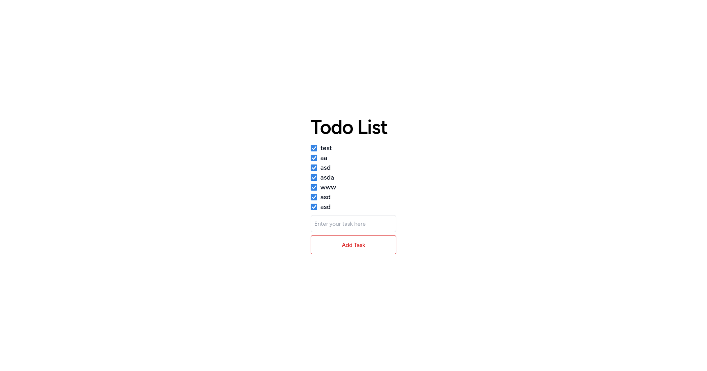

# Laravel web app

This is a web app made with laravel.



## .env
Copy the content of .env.example to .env and change what needed.

run

```bash
php artisan serve

```

create a model

```bash
php artisan make:model Task -m
```

rollback when changing migration file

```bash
php artisan migrate:rollback
```

migrate

```bash
php artisan migrate
```

create a controller

```bash
php artisan make:controller TaskController
```
