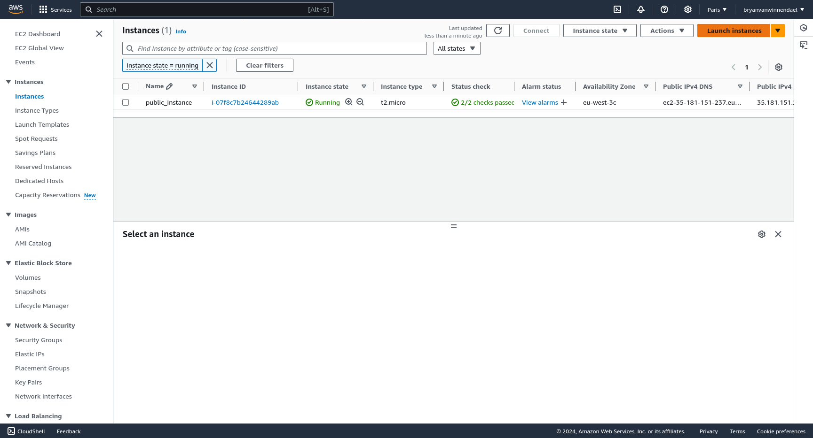

# AWS Instance with Terraform



## Prerequisites:
  - [AWS account](https://signin.aws.amazon.com/signup?request_type=register) and credentials (AWS Access Key and Secret Key).
  - [Terraform](../) installed on your local machine.

## Terraform Configuration File

Fill in the access_key and secret_key
```
provider "aws" {
  region = "eu-west-3"
  access_key = "***"
  secret_key = "***"
}
```
You can change the name of the instance "public_instance" to .

```
resource "aws_instance" "public_instance" {
  ami           = "ami-045a8ab02aadf4f88"
  instance_type = "t2.micro"
  key_name      = aws_key_pair.key_pair.key_name

  tags = {
    Name = "public_instance"
  }
}
```

## Initialize
This will download all the necessary providers and modules specified in your configuration.

```bash
terraform init
```

## Preview the Execution Plan
This will display the actions Terraform will perform without actually applying them.

```bash
terraform plan
```

## Apply the Configuration
Once you are satisfied with the plan, you can apply it to provision your AWS infrastructure. Terraform will ask for confirmation before making any changes.

```bash
terraform apply
```

Type 'yes' when prompted, and Terraform will begin creating the resources. Once completed, it will display the details of the newly created instance.